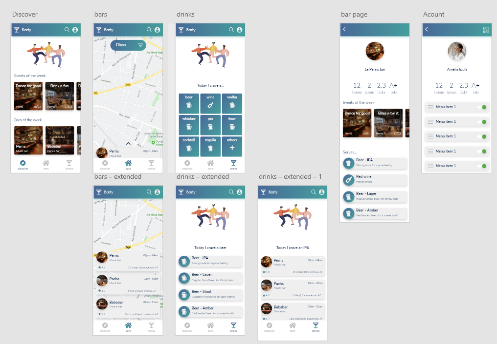

# Barty

bar app

## Adobe XD screenshot

You can send an email to galliotlucas@gmail.com to be added to the adobeXD file. In the meantime. Here's a basic idea of what the app should look like.

## Releases

Please find more infos about every release/update in the [following file](markdown/releases.md)

## RoadMap

Here is a non-exhaustive list of what's next and what has been done

[*] Create empty pages (skeleton)

[*] Add fonts and assets

[*] Create basic cards 

[] Fetch using async/await and simulate network latency

[] Create a backend service

## Participate

### Language

Please write comments in english as you never know who might one day participate in the project. Most of the languages funcions are already written in english anyway... Let's make one small effort. It helps code cleanness avoiding Fren-glish.

### Clean code

Clean code = easier maintainance. Flutter/Dart has a temperamental formatter. But, using formatter helps automatically keep the code clean and well shapped. In VSCode it is sused using the cmd `alt` + `shift` + `f`. In order to make it actually clean; the formatter recomands that we leave 'trailing commas' so let's do it.

Source : [Flutter formatter](https://flutter.dev/docs/development/tools/formatting)

### ReadMe

Readme and markdown are easy ways to communicate with what's new in the project. We recommand you update those files everytime you add smth to the project using the maximum ammount of details.

