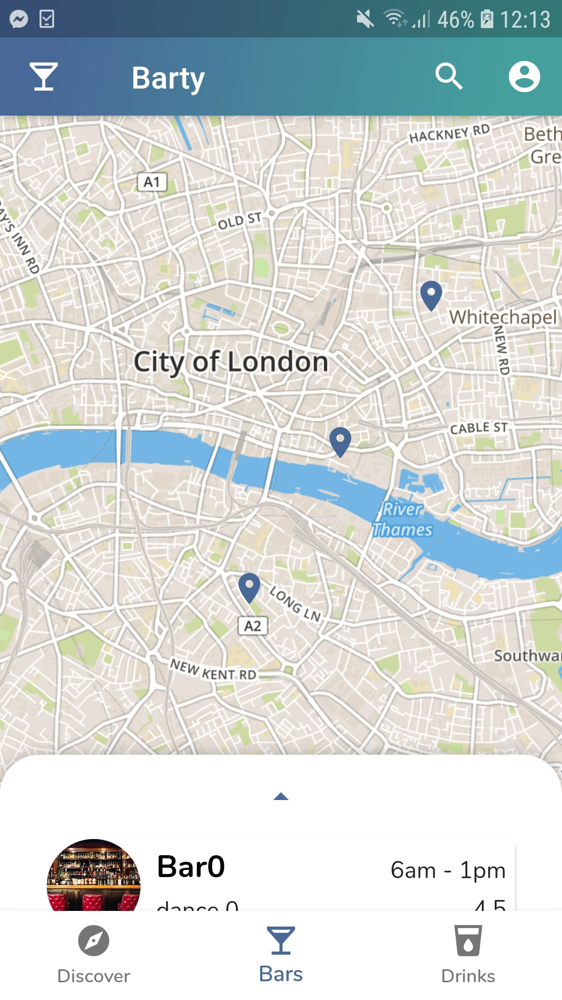
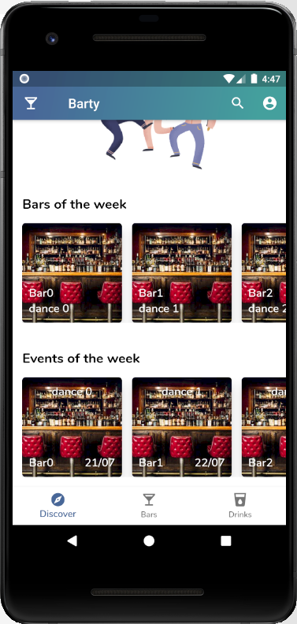
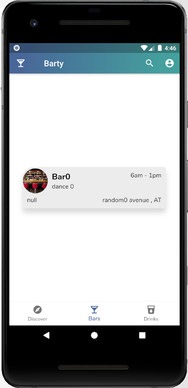
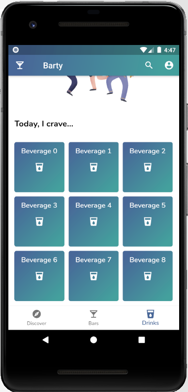
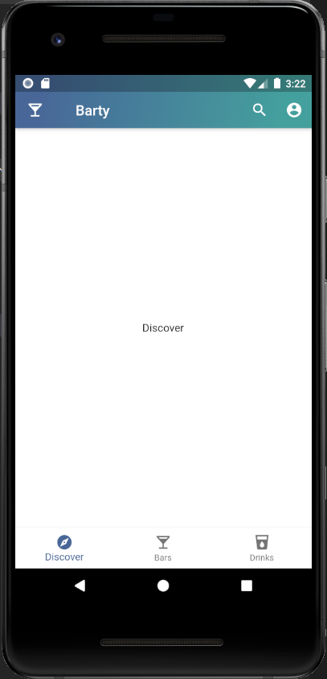

# Releases

This is where you find informations about each releases

## 0.3.1 - Map geolocation

We used the user's location to center the map around. This is made using the geolocator plugin given by flutter. We followed this exact [tutorial](https://alligator.io/flutter/geolocator-plugin/)

### 0.3.0 - Map + MVVM

Implemented map and project is now using a MVVM structure.

What has been done:

* using an external widget, we created a pannel that overlays the map
* we used flutter map in combinaison with mapbox to create a cool looking map
* project data is now fetched externally and not directly in the widget's state using MVVM code separation principles
* Mostly used a real device to test the app = better idea of how it works.

TODO for this release:

[] Make the bar detail card look better, find new design

## 0.2.1 - QR Code UI

QR code is now removed. As a slider is considered to be a better option

### 0.2.0 (deprecated) QR Code UI

What has been done:

* QR Code is available in the account navbar
* Data can be passed to routes
* Placeholder data has been initialized in the QRCode while waiting for a login workflow

## 0.1.0 - Basic cards

This is the second build release. Here, we created:

* Bar cards
* Bar detail cards
* Event cards
* Beverage cards

We also started to implement a few layouts using those cards. The design starts to take shape. This includes:

* Account page skeleton
* Account appbar featureless (ui only)
* Discover page layout
* Drinks page layout

> Here you can find more about the features in pictures.

|  |  |   | 
|---|---|---|

## 0.0.0 - Skeleton

In this first release, we created the app's skeleton. This includes : 

* Appbar
* Bottom Navigation Bar
* One empty page per item in the BottomAppBar
* A component
* the basic project structure (ui - model) to which we'll later add services and others

